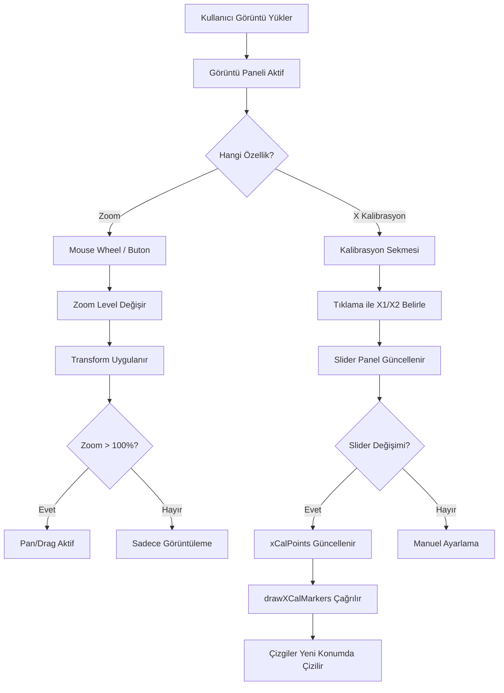

# X-Ekseni Kalibrasyon Çizgi Kaydırma ve Zoom Özellikleri Planı

## 📋 Özet

Kullanıcının talep ettiği iki yeni özellik:

1. **X-Ekseni Kalibrasyon Çizgi Kaydırma Paneli**: X1 ve X2 çizgilerini X ekseninde slider ile kaydırabilme
2. **Görsele Yakınlaşma (Zoom)**: Görüntüye zoom in/out yapabilme

---

## 🎯 Özellik 1: X-Ekseni Kalibrasyon Çizgi Kaydırma Paneli

### Mevcut Durum

- X kalibrasyonu için tıklama ile X1 ve X2 noktaları alınıyor
- [`state.xCalPoints`](frontend/js/app.js:20) içinde `{x1, x2}` saklanıyor
- [`drawXCalMarkers()`](frontend/js/app.js:650) fonksiyonu ile canvas üzerine çiziliyor

### Yeni Tasarım

```
┌─────────────────────────────────────────────┐
│ X-Ekseni Uzunluk Kalibrasyonu              │
├─────────────────────────────────────────────┤
│ [1] Sol Kenar  →  [2] Sağ Kenar            │
│                                             │
│ Sol Kenar (x):  245 px                      │
│ Sağ Kenar (x):  890 px                      │
│ Uzunluk (px):   645 px                      │
│                                             │
│ ┌─────────────────────────────────────────┐ │
│ │ Çizgi Ayarlama                          │ │
│ │ X1: ◀─────●──────────────────────▶ 245 │ │
│ │ X2: ◀─────────────────●──────────▶ 890 │ │
│ └─────────────────────────────────────────┘ │
│                                             │
│ Gerçek Uzunluk (mm): [18.90]               │
│ [X-Eksenini Kalibre Et] [↺]                │
└─────────────────────────────────────────────┘
```

### Teknik Uygulama

#### HTML Değişiklikleri ([`frontend/index.html`](frontend/index.html:182-228))

```html
<!-- .cal-x-section içine eklenecek -->
<div class="cal-x-slider-panel" id="cal-x-slider-panel">
    <div class="cal-x-slider-header">Çizgi Ayarlama</div>
    <div class="cal-x-slider-row">
        <label class="cal-x-slider-label">X1:</label>
        <input type="range" class="cal-x-slider" id="cal-x1-slider" min="0" max="1000" value="0">
        <span class="cal-x-slider-value" id="cal-x1-slider-value">—</span>
    </div>
    <div class="cal-x-slider-row">
        <label class="cal-x-slider-label">X2:</label>
        <input type="range" class="cal-x-slider" id="cal-x2-slider" min="0" max="1000" value="0">
        <span class="cal-x-slider-value" id="cal-x2-slider-value">—</span>
    </div>
</div>
```

#### CSS Değişiklikleri ([`frontend/css/style.css`](frontend/css/style.css))

```css
/* X Kalibrasyon Slider Paneli */
.cal-x-slider-panel {
    margin-top: 12px;
    padding: 12px;
    background: rgba(245, 158, 11, 0.05);
    border: 1px solid rgba(245, 158, 11, 0.2);
    border-radius: 6px;
}

.cal-x-slider-header {
    font-size: 11px;
    font-weight: 600;
    color: var(--accent, #f59e0b);
    margin-bottom: 10px;
    text-transform: uppercase;
    letter-spacing: 0.5px;
}

.cal-x-slider-row {
    display: flex;
    align-items: center;
    gap: 10px;
    margin-bottom: 8px;
}

.cal-x-slider-label {
    font-size: 12px;
    font-weight: 600;
    color: var(--text-secondary, #94a3b8);
    width: 30px;
}

.cal-x-slider {
    flex: 1;
    -webkit-appearance: none;
    height: 6px;
    background: var(--bg-tertiary, #1e293b);
    border-radius: 3px;
    cursor: pointer;
}

.cal-x-slider::-webkit-slider-thumb {
    -webkit-appearance: none;
    width: 16px;
    height: 16px;
    background: var(--accent, #f59e0b);
    border-radius: 50%;
    cursor: grab;
    transition: transform 0.15s ease;
}

.cal-x-slider::-webkit-slider-thumb:hover {
    transform: scale(1.2);
}

.cal-x-slider-value {
    font-size: 11px;
    font-family: 'JetBrains Mono', monospace;
    color: var(--text-secondary, #94a3b8);
    width: 50px;
    text-align: right;
}
```

#### JS Değişiklikleri ([`frontend/js/app.js`](frontend/js/app.js))

1. **Yeni DOM referansları**:
   ```javascript
   DOM.calXSliderPanel = document.getElementById('cal-x-slider-panel');
   DOM.calX1Slider = document.getElementById('cal-x1-slider');
   DOM.calX2Slider = document.getElementById('cal-x2-slider');
   DOM.calX1SliderValue = document.getElementById('cal-x1-slider-value');
   DOM.calX2SliderValue = document.getElementById('cal-x2-slider-value');
   ```

2. **Slider event listener'ları**:
   ```javascript
   function setupXCalSliders() {
       DOM.calX1Slider.addEventListener('input', (e) => {
           if (state.xCalPoints.x1 === null) return;
           state.xCalPoints.x1 = parseInt(e.target.value);
           DOM.calX1SliderValue.textContent = `${state.xCalPoints.x1} px`;
           DOM.calX1.textContent = `${state.xCalPoints.x1} px`;
           updateXCalDistance();
           drawXCalMarkers();
       });
       
       DOM.calX2Slider.addEventListener('input', (e) => {
           if (state.xCalPoints.x2 === null) return;
           state.xCalPoints.x2 = parseInt(e.target.value);
           DOM.calX2SliderValue.textContent = `${state.xCalPoints.x2} px`;
           DOM.calX2.textContent = `${state.xCalPoints.x2} px`;
           updateXCalDistance();
           drawXCalMarkers();
       });
   }
   ```

3. **Slider max değerini görüntü genişliğine göre ayarla**:
   ```javascript
   function updateXSliderRange() {
       const img = state.processedImageId ? DOM.processedImage : DOM.originalImage;
       if (!img || !img.naturalWidth) return;
       
       const maxVal = img.naturalWidth;
       DOM.calX1Slider.max = maxVal;
       DOM.calX2Slider.max = maxVal;
   }
   ```

4. **Mevcut tıklama sonrası slider'ı güncelle**:
   ```javascript
   // handleXCalClick içinde, tıklama sonrası:
   DOM.calX1Slider.value = state.xCalPoints.x1;
   DOM.calX1SliderValue.textContent = `${state.xCalPoints.x1} px`;
   ```

---

## 🔍 Özellik 2: Görsele Yakınlaşma (Zoom)

### Tasarım

```
┌─────────────────────────────────────────────────────────┐
│                                    [−] [100%] [+] [📐] │  <-- Zoom kontrolleri
├─────────────────────────────────────────────────────────┤
│                                                         │
│     ┌───────────────────────────────┐                  │
│     │                               │                  │
│     │      [GÖRÜNTÜ - ZOOM]        │                  │
│     │      (mouse wheel zoom)      │                  │
│     │      (pan/drag)              │                  │
│     │                               │                  │
│     └───────────────────────────────┘                  │
│                                                         │
└─────────────────────────────────────────────────────────┘
```

### Zoom Kontrolleri

- **Mouse Wheel**: Görüntü üzerine gelip scroll ile zoom in/out
- **Zoom Butonları**: [−] %100 [+] şeklinde toolbar butonları
- **Pan/Drag**: Zoom yapıldığında görüntüyü sürükleyerek kaydırma
- **Sıfırla**: %100'e döndüren buton

### Teknik Uygulama

#### HTML Değişiklikleri

```html
<!-- .content-toolbar içine eklenecek -->
<div class="zoom-controls">
    <button class="zoom-btn" id="btn-zoom-out" title="Uzaklaştır">−</button>
    <span class="zoom-level" id="zoom-level">100%</span>
    <button class="zoom-btn" id="btn-zoom-in" title="Yakınlaştır">+</button>
    <button class="zoom-btn" id="btn-zoom-fit" title="Ekrana Sığdır">📐</button>
</div>
```

#### CSS Değişiklikleri

```css
/* Zoom Container */
.image-canvas-wrapper {
    position: relative;
    overflow: hidden;
    cursor: grab;
}

.image-canvas-wrapper.zooming {
    cursor: move;
}

.image-canvas-wrapper.dragging {
    cursor: grabbing;
}

/* Zoom kontrolleri */
.zoom-controls {
    display: flex;
    align-items: center;
    gap: 4px;
    padding: 4px 8px;
    background: var(--bg-secondary, #111820);
    border-radius: 6px;
    border: 1px solid var(--border-color, #1e293b);
}

.zoom-btn {
    width: 28px;
    height: 28px;
    display: flex;
    align-items: center;
    justify-content: center;
    background: var(--bg-tertiary, #1e293b);
    border: 1px solid var(--border-color, #334155);
    border-radius: 4px;
    color: var(--text-primary, #e2e8f0);
    font-size: 16px;
    cursor: pointer;
    transition: all 0.15s ease;
}

.zoom-btn:hover {
    background: var(--accent, #f59e0b);
    border-color: var(--accent, #f59e0b);
    color: #000;
}

.zoom-level {
    font-size: 12px;
    font-family: 'JetBrains Mono', monospace;
    color: var(--text-secondary, #94a3b8);
    min-width: 50px;
    text-align: center;
}

/* Zoom transform */
.zoom-container {
    transform-origin: center center;
    transition: transform 0.1s ease-out;
}
```

#### JS Değişiklikleri

1. **State'e zoom ekle**:
   ```javascript
   const state = {
       // ... mevcut state
       zoom: {
           level: 1.0,
           minLevel: 0.25,
           maxLevel: 4.0,
           panX: 0,
           panY: 0,
           isDragging: false,
           startX: 0,
           startY: 0
       }
   };
   ```

2. **Zoom fonksiyonları**:
   ```javascript
   function setupZoom() {
       const wrappers = document.querySelectorAll('.image-canvas-wrapper');
       
       wrappers.forEach(wrapper => {
           // Mouse wheel zoom
           wrapper.addEventListener('wheel', (e) => {
               e.preventDefault();
               const delta = e.deltaY > 0 ? -0.1 : 0.1;
               adjustZoom(delta, e.clientX, e.clientY);
           });
           
           // Pan/drag
           wrapper.addEventListener('mousedown', (e) => {
               if (state.zoom.level > 1.0) {
                   state.zoom.isDragging = true;
                   state.zoom.startX = e.clientX - state.zoom.panX;
                   state.zoom.startY = e.clientY - state.zoom.panY;
                   wrapper.classList.add('dragging');
               }
           });
       });
       
       document.addEventListener('mousemove', (e) => {
           if (state.zoom.isDragging) {
               state.zoom.panX = e.clientX - state.zoom.startX;
               state.zoom.panY = e.clientY - state.zoom.startY;
               applyZoomTransform();
           }
       });
       
       document.addEventListener('mouseup', () => {
           state.zoom.isDragging = false;
           document.querySelectorAll('.image-canvas-wrapper').forEach(w => {
               w.classList.remove('dragging');
           });
       });
       
       // Zoom butonları
       DOM.btnZoomIn.addEventListener('click', () => adjustZoom(0.25));
       DOM.btnZoomOut.addEventListener('click', () => adjustZoom(-0.25));
       DOM.btnZoomFit.addEventListener('click', resetZoom);
   }
   
   function adjustZoom(delta, originX = null, originY = null) {
       const newLevel = Math.max(state.zoom.minLevel, 
                                 Math.min(state.zoom.maxLevel, state.zoom.level + delta));
       state.zoom.level = newLevel;
       DOM.zoomLevel.textContent = `${Math.round(newLevel * 100)}%`;
       applyZoomTransform();
   }
   
   function resetZoom() {
       state.zoom.level = 1.0;
       state.zoom.panX = 0;
       state.zoom.panY = 0;
       DOM.zoomLevel.textContent = '100%';
       applyZoomTransform();
   }
   
   function applyZoomTransform() {
       const wrappers = document.querySelectorAll('.image-canvas-wrapper');
       wrappers.forEach(wrapper => {
           const img = wrapper.querySelector('img');
           const canvas = wrapper.querySelector('canvas');
           [img, canvas].forEach(el => {
               if (el) {
                   el.style.transform = `scale(${state.zoom.level}) translate(${state.zoom.panX}px, ${state.zoom.panY}px)`;
               }
           });
       });
   }
   ```

---

## 📊 Uygulama Akışı



---

## 📁 Değiştirilecek Dosyalar

| Dosya | Değişiklik Türü |
|-------|-----------------|
| [`frontend/index.html`](frontend/index.html) | HTML ekleme: Slider paneli, zoom kontrolleri |
| [`frontend/css/style.css`](frontend/css/style.css) | CSS ekleme: Slider stilleri, zoom stilleri |
| [`frontend/js/app.js`](frontend/js/app.js) | JS ekleme: Slider logic, zoom logic |
| [`CHANGELOG.md`](CHANGELOG.md) | Dokümantasyon güncelleme |

---

## ⚠️ Dikkat Edilmesi Gerekenler

1. **Slider Max Değeri**: Görüntü yüklendiğinde `naturalWidth` alınıp slider max'a set edilmeli
2. **Zoom + Canvas Overlay**: Zoom yapıldığında X kalibrasyon canvas çizgileri de doğru orantılanmalı
3. **Performans**: Zoom animasyonları için `requestAnimationFrame` kullanılabilir
4. **Mobil**: Touch cihazlarda pinch-to-zoom desteği düşünülebilir

---

## ✅ Onay Sonrası Yapılacaklar

1. Code moduna geçiş
2. HTML değişikliklerini uygula
3. CSS stilleri ekle
4. JavaScript fonksiyonlarını yaz
5. CHANGELOG.md güncelle
6. Test et